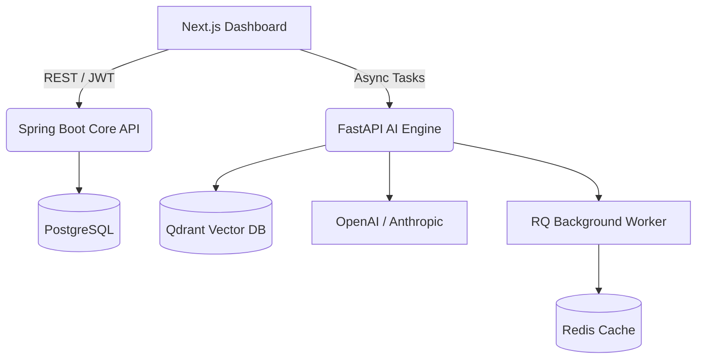

<div align="center">
  
  <h1>Shadow Engineer</h1>
  <p><strong>The Autonomous AI Pair Programmer for Enterprise Teams</strong></p>
  
  [](https://github.com/lakshmipriyasaravanan/Shadow-Engineer/releases)
  [](https://github.com/lakshmipriyasaravanan/Shadow-Engineer/actions)
  [](LICENSE)
  [](https://spring.io/)
  [](https://fastapi.tiangolo.com/)
  [](https://nextjs.org/)
</div>

<hr/>

Shadow Engineer is a cloud-native Developer Productivity platform that deeply understands your codebase. It autonomously generates documentation, writes test suites, reviews Pull Requests, and answers complex architectural questions by leveraging advanced Retrieval-Augmented Generation (RAG).

## 🚀 Key Features

- **Repository Intelligence**: Ingests and semantically indexes your entire Git repository into Qdrant.
- **AI Pull Request Reviewer**: Autonomously reviews PRs, assigning security and maintainability scores while suggesting actionable code snippets.
- **Artifact Generator**: Acts as an Elite Technical Writer to generate Onboarding Guides and Mermaid.js Architecture Diagrams.
- **Developer Copilot Chat**: A specialized ChatGPT-like interface that intimately knows your proprietary codebase.
- **Enterprise Analytics**: Robust tenant-level insights calculating AI Health Scores and token consumption.

## 🏗️ Architecture



## 🛠️ Quick Start

### 1. Prerequisites
- Docker & Docker Compose
- Java 21 (optional, for local dev)
- Python 3.11 (optional, for local dev)
- Node.js 20 (optional, for local dev)

### 2. Environment Setup
```bash
cp .env.example .env
# Edit .env with your OpenAI API Key and GitHub OAuth credentials
```

### 3. Run the Stack
We use a centralized `Makefile` for developer orchestration.
```bash
make run
```
Access the dashboard at [http://localhost:3000](http://localhost:3000).

## 📚 Documentation
- [Architecture & HLD](docs/04_Architecture/HLD.md)
- [Deployment & DevOps](docs/09_DevOps/Deployment_Guide.md)
- [Enterprise Analytics](docs/08_Engineering/Analytics_Guide.md)
- [Contributing](CONTRIBUTING.md)

## 🛡️ Security
Please review our [Security Policy](SECURITY.md) before reporting vulnerabilities.

## 📄 License
This project is licensed under the MIT License.
