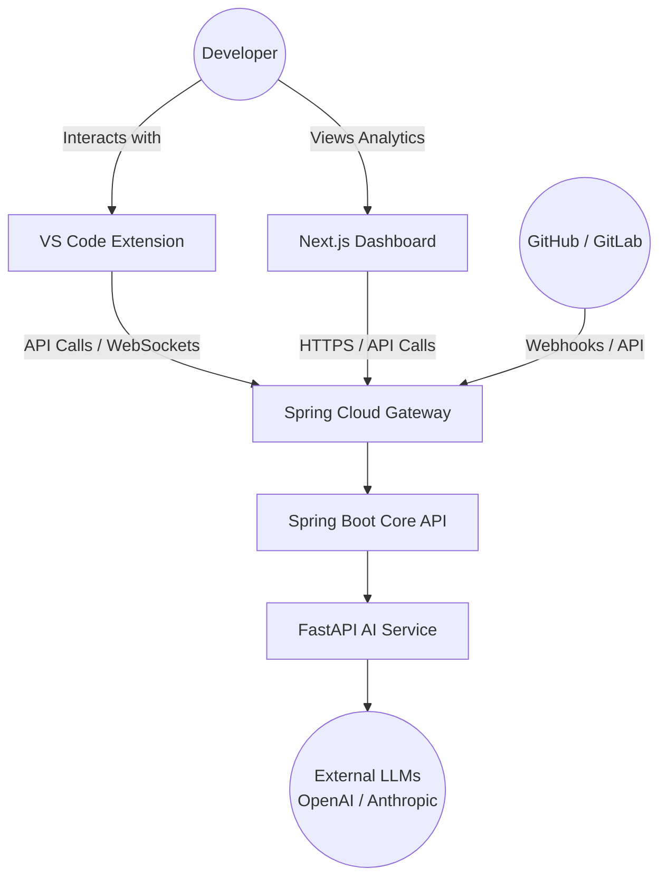
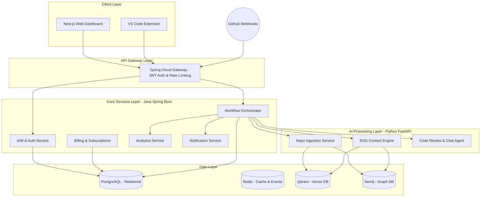
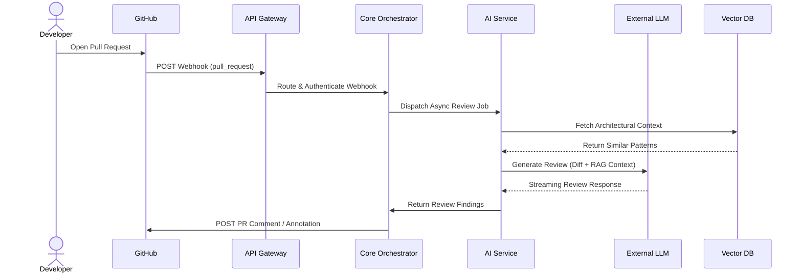
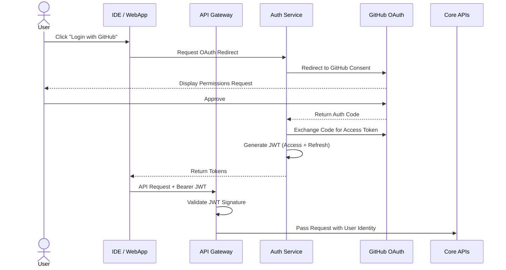
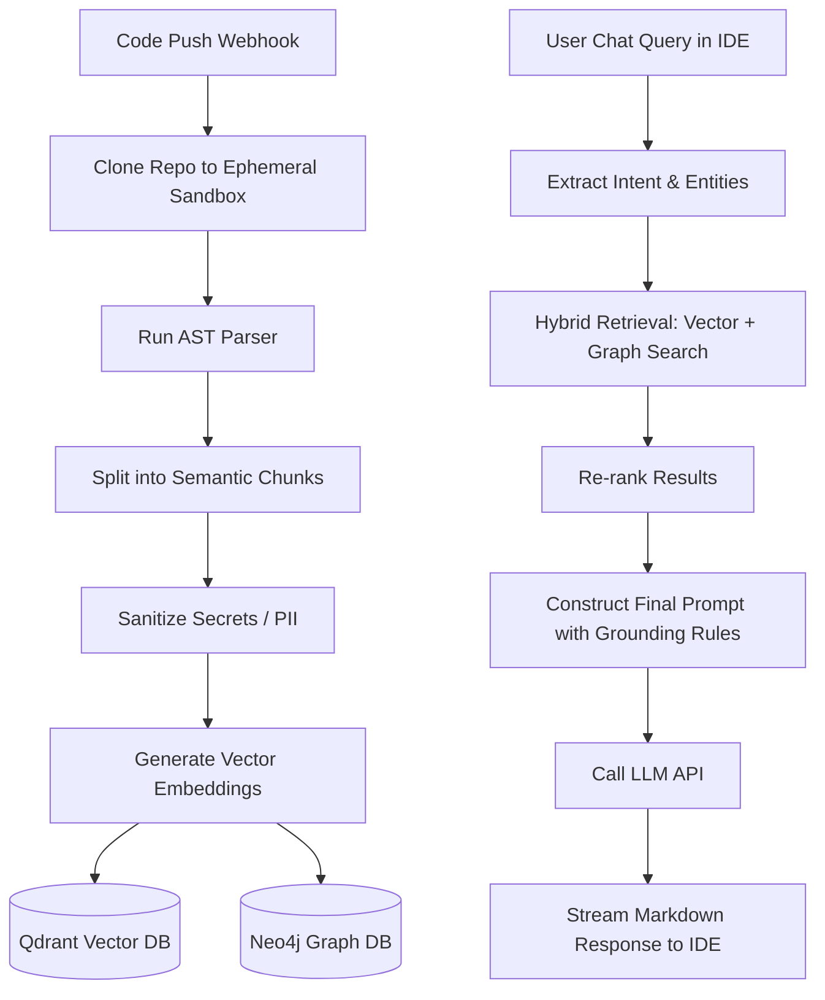

# High-Level Design (HLD)

## 1. Document Information
This High-Level Design (HLD) document outlines the architectural blueprint for the **Shadow Engineer** platform. It translates the requirements specified in the Software Requirement Specification (SRS) into a scalable, robust, and maintainable system architecture. 

## 2. Purpose
The purpose of this document is to provide a comprehensive architectural view of the system to guide software engineers, product managers, and stakeholders during the development lifecycle. It establishes the foundational design patterns, technology stacks, deployment strategies, and security protocols required to build an AI-powered software engineering teammate.

## 3. Scope
This HLD covers:
*   High-level system architecture and context.
*   Major components, their responsibilities, and communication patterns.
*   Data flows for core capabilities (Authentication, Code Ingestion, AI Code Review).
*   Deployment and security architectures.
*   Scalability, monitoring, and disaster recovery strategies.
*   The transition plan from a modular monolith to a microservices architecture.

## 4. Architecture Principles
*   **Progressive Complexity:** Start with a Modular Monolith during MVP for speed of delivery, and evolve into microservices as scaling requires.
*   **Separation of Concerns:** Strictly separate the business orchestration layer from the highly compute-intensive AI operations.
*   **Event-Driven Communication:** Decouple services using asynchronous events (starting with application events, graduating to Kafka).
*   **Secure by Design:** Assume zero trust. Mandate strict tenant isolation, RBAC, and secret sanitization before AI ingestion.
*   **Observable:** Ensure every interaction, from the IDE to the LLM backend, is fully traceable using distributed tracing.

## 5. Technology Stack with Justification

| Layer | Technology | Justification |
| :--- | :--- | :--- |
| **Frontend / Dashboard** | Next.js, React, TypeScript, Tailwind CSS, shadcn/ui | Industry standard for rich, performant, Server-Side Rendered (SSR) dashboards with excellent developer experience. |
| **Backend (Core API)** | Spring Boot 3, Java 21 | Robust enterprise framework. Java 21 Virtual Threads provide excellent concurrency for handling high volumes of webhooks without the complexity of reactive programming. |
| **API Gateway** | Spring Cloud Gateway | Provides dynamic routing, rate limiting, and centralized JWT validation before requests reach internal services. |
| **AI Services** | Python, FastAPI | The dominant ecosystem for AI/ML. Integrates natively with LangChain, LlamaIndex, and GPU-accelerated libraries. |
| **Relational Database** | PostgreSQL | ACID-compliant storage for users, RBAC, billing, and organizational metadata. |
| **Vector Database** | Qdrant (or Pinecone) | High-performance similarity search required for Retrieval-Augmented Generation (RAG) on code chunks. |
| **Graph Database (Future)**| Neo4j | Essential for mapping complex dependencies (functions, imports, microservices) across large codebases. |
| **Caching / Event Bus** | Redis | Ephemeral storage for rate limiting, session caching, and initial webhook queueing. |
| **Infrastructure / DevOps**| AWS, Docker, GitHub Actions, Terraform | Scalable cloud-native deployment. Terraform ensures Infrastructure as Code (IaC) compliance. |

---

## 6. System Context Diagram

The System Context diagram illustrates how external actors interact with the Shadow Engineer platform.

---

## 7. High-Level Architecture Diagram

The system adopts a modular monolith approach for the Core API, cleanly separated from the AI execution environment.

---

## 8. Major Components

1.  **Spring Cloud Gateway:** The entry point for all traffic. Handles SSL termination, rate limiting, and JWT token validation.
2.  **IAM & Auth Service:** Manages GitHub OAuth integration, JWT generation, and Role-Based Access Control (RBAC).
3.  **Workflow Orchestrator:** The central nervous system of the Java backend. Receives webhooks and dispatches events (e.g., triggering a code review when a PR is opened).
4.  **Analytics Service:** Aggregates data to calculate developer velocity, technical debt, and AI usage metrics.
5.  **Repo Ingestion Service (Python):** Clones repositories into ephemeral sandboxes, runs Abstract Syntax Tree (AST) parsers, chunks the code, generates embeddings, and saves them to the Vector DB.
6.  **RAG Context Engine (Python):** Receives queries, performs hybrid search (Vector + Keyword + Graph), and constructs highly relevant prompt contexts.
7.  **Agent Router (Python):** Routes specialized tasks (e.g., PR review vs. IDE chat) to the appropriate LLM prompt chains.

## 9. Responsibilities of Each Component
*   **Java Core:** Focuses entirely on business rules, tenant isolation, billing, API routing, and system state. It does not parse code or execute AI logic.
*   **Python AI Service:** Focuses entirely on computationally expensive tasks: parsing ASTs, generating vector embeddings, running LLM inference, and maintaining the Knowledge Graph.

## 10. Component Communication
During the MVP phase, component communication within the Java ecosystem utilizes **Spring Application Events** to maintain loose coupling while avoiding the overhead of external message brokers.
Communication between the Java Core and the Python AI Service occurs via **synchronous REST APIs** for fast queries (e.g., chat) and **asynchronous Redis queues** for long-running jobs (e.g., repo ingestion).
In Phase 3 (Microservices), all cross-domain communication will migrate to **Apache Kafka**.

---

## 11. Data Flow

### Automated PR Review Flow

---

## 12. Authentication Flow

---

## 13. AI Workflow (RAG Pipeline)

---

## 14. Deployment Architecture
Shadow Engineer will utilize a progressive deployment strategy mapped to the startup's growth phases.

1.  **Development:** Docker & Docker Compose (Local execution of all containers).
2.  **Alpha/MVP:** AWS EC2 (Single instance running Docker Compose for simplicity).
3.  **Beta:** AWS ECS (Elastic Container Service) with AWS RDS (Postgres).
4.  **Production Scale:** AWS EKS (Elastic Kubernetes Service) with Helm charts, managed Redis (ElastiCache), and multi-AZ deployments.

---

## 15. Security Architecture
*   **Authentication:** Stateless JWTs signed with RS256. API Gateway enforces token presence and validity before routing.
*   **Tenant Isolation:** Row-Level Security (RLS) in PostgreSQL. Namespaces in Qdrant ensure vectors belonging to Organization A are invisible to Organization B.
*   **Secret Management:** HashiCorp Vault (or AWS Secrets Manager) securely injects environment variables.
*   **Sanitization:** The AI Ingestion service utilizes a regex/entropy-based secret scanner to strip hardcoded API keys before passing code to external LLMs.
*   **LLM Privacy:** Strict zero-retention Enterprise agreements with OpenAI/Anthropic to ensure customer code is never used for foundational model training.

## 16. Scalability Strategy
*   **Stateless Services:** Both Spring Boot and FastAPI services are stateless, allowing aggressive horizontal scaling via Kubernetes HPA (Horizontal Pod Autoscaling).
*   **Asynchronous Processing:** Long-running LLM inferences and repository indexing jobs are decoupled from the HTTP request thread, preventing timeouts.
*   **Vector DB Sharding:** Qdrant collections will be sharded across multiple nodes to maintain sub-100ms retrieval latencies as the vector count scales into the billions.

## 17. Monitoring & Logging
*   **Distributed Tracing:** OpenTelemetry (OTel) injects `trace-id` headers at the API Gateway, maintaining correlation across Java, Python, and DB layers.
*   **Metrics:** Prometheus scrapes system metrics (CPU, Memory, GC pauses, JVM threads, LLM token counts).
*   **Visualization:** Grafana dashboards provide real-time alerting on LLM API failures, webhook processing lags, and 5xx error rates.
*   **Log Aggregation:** Fluent Bit ships structured JSON logs to a centralized Datadog or ELK/Loki stack.

## 18. Disaster Recovery
*   **RPO (Recovery Point Objective):** 5 minutes for Relational Data (managed via RDS automated backups and WAL archiving). Vector embeddings can be fully regenerated from source code if necessary.
*   **RTO (Recovery Time Objective):** 1 hour. Infrastructure is fully codified using Terraform, allowing an entire region to be spun up from scratch if a complete AZ outage occurs.

## 19. Future Expansion Strategy
*   **Full Microservices (Kafka Integration):** Transitioning in-memory Spring Events to Apache Kafka topics (`repo.indexed`, `pr.analyzed`) to allow polyglot microservices to subscribe to state changes.
*   **Agentic Multi-Step Reasoning:** Transitioning from single-shot RAG to ReAct (Reasoning + Acting) agents that can autonomously execute `grep` searches against the repository to debug complex compilation errors.
