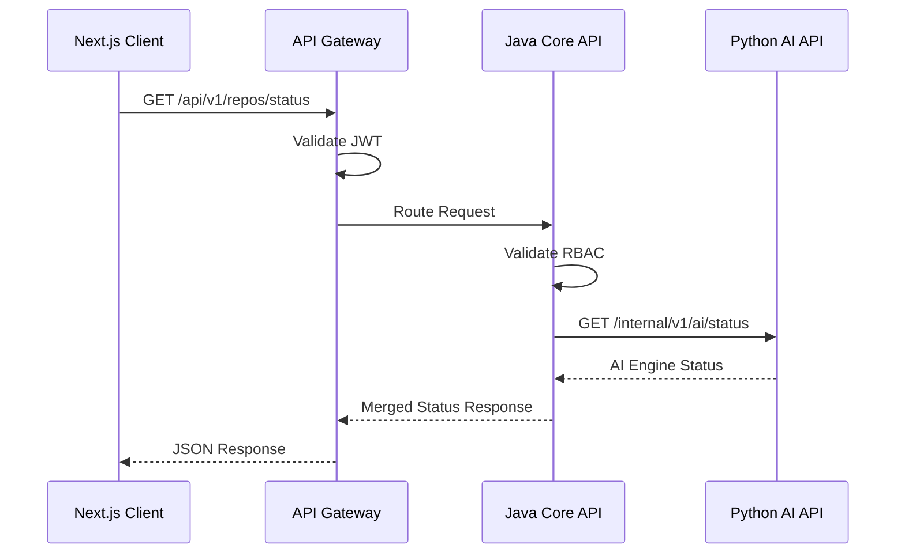
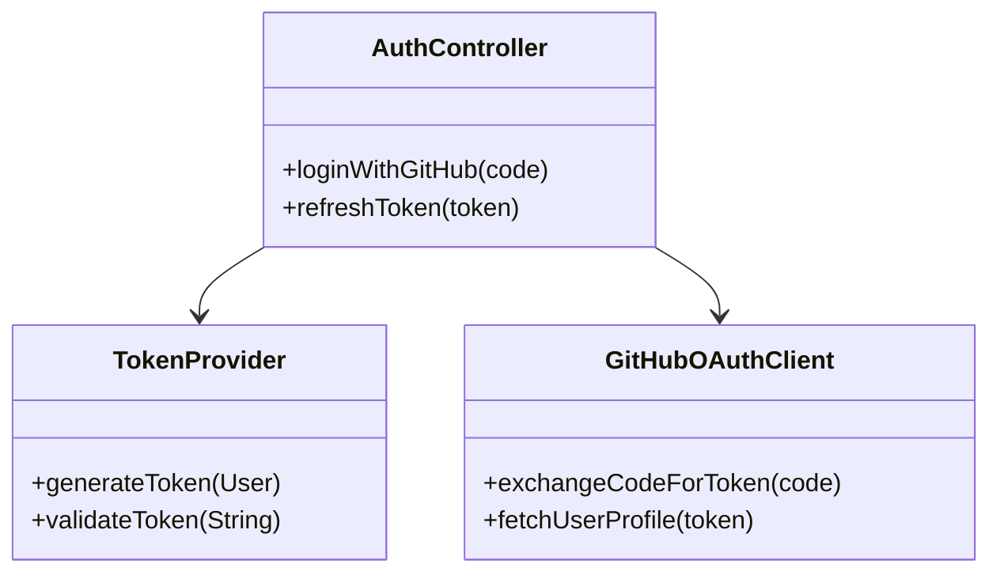
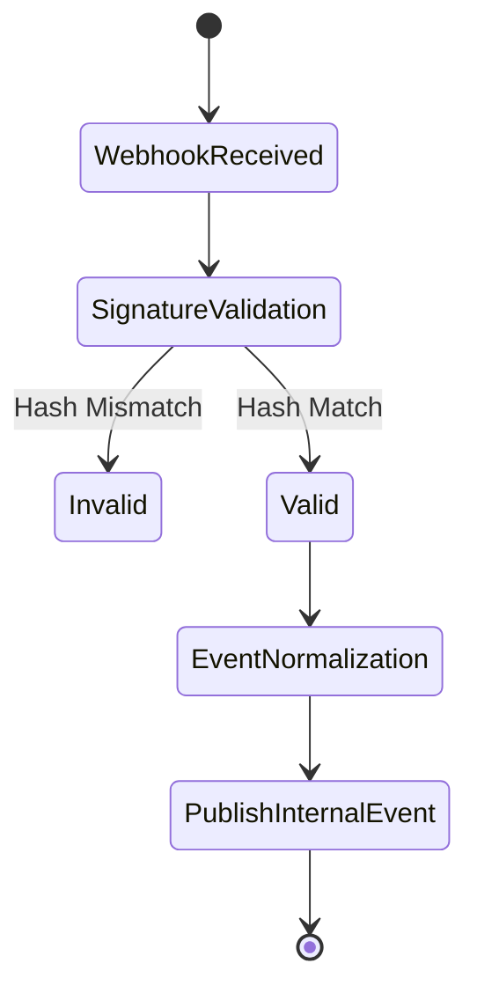
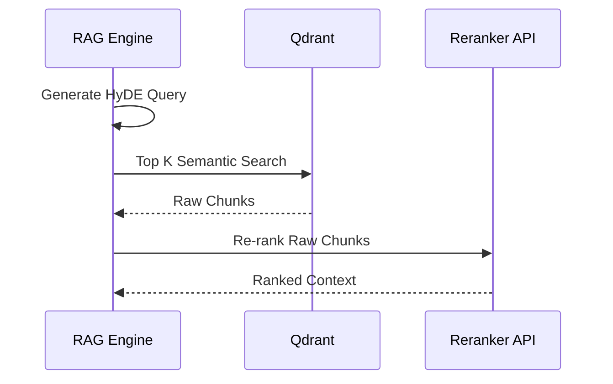
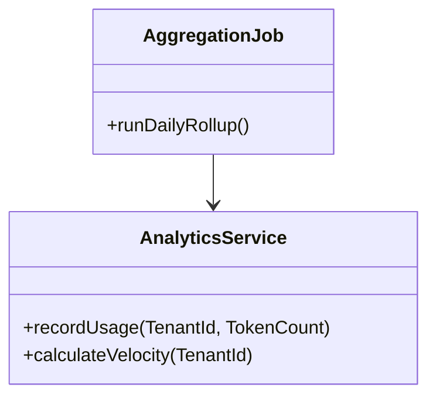

# Shadow Engineer: Low-Level Design (LLD)

## 1. Module Overview
Shadow Engineer is composed of several independent domains executing within a modular monolith (Java) and an AI service layer (Python). 

*   **Java Core (Spring Boot):** Authentication, Analytics, Notifications, Admin Dashboard, GitHub Integration.
*   **Python Core (FastAPI):** Repository Intelligence (Ingestion), AI Knowledge Engine (RAG), AI Code Review, Documentation Generator, Test Generator.

## 2. Directory & Package Structure

### 2.1 Folder Structure (Monorepo)
```text
shadow-engineer/
├── apps/
│   ├── web/                      # Next.js Frontend
│   ├── api-gateway/              # Spring Cloud Gateway
│   ├── core-service/             # Spring Boot 3 Business Logic
│   └── ai-service/               # Python FastAPI AI Layer
├── shared/
│   ├── openapi/                  # API Contracts (Swagger/OpenAPI)
│   └── events/                   # Shared Event schemas (Avro/JSON)
```

### 2.2 Package Structure (Java Spring Boot)
Using Domain-Driven Design (DDD) principles:
```text
com.shadowengineer.core
├── auth/
│   ├── controller/
│   ├── service/
│   ├── repository/
│   └── security/
├── github/
├── analytics/
├── notifications/
└── orchestrator/
```

### 2.3 Package Structure (Python FastAPI)
```text
app/
├── routers/
├── services/
│   ├── ingestion/
│   ├── rag/
│   └── agents/
├── core/
│   ├── llm_client.py
│   └── vector_db.py
└── models/
```

---

## 3. Global Design Strategies

### 3.1 Validation Flow
All incoming HTTP requests are validated at two layers:
1.  **API Gateway:** Basic schema validation and JWT verification.
2.  **Controller/Router Layer:** 
    *   Java: `jakarta.validation` (`@Valid`, `@NotNull`) for strict payload checking.
    *   Python: `Pydantic` models ensuring strict type safety for LLM prompts and API requests.

### 3.2 Exception Handling
*   **Java:** `@ControllerAdvice` catches domain exceptions (`ResourceNotFoundException`, `UnauthorizedException`) and maps them to RFC 7807 standard `ProblemDetail` JSON responses.
*   **Python:** FastAPI Exception Handlers map `HTTPException` and internal LLM timeout errors to standard JSON structures matching the Java core.

### 3.3 Logging Strategy
*   Structured JSON logging using `Logback` (Java) and `structlog` (Python).
*   **MDC (Mapped Diagnostic Context):** Injects `trace_id`, `tenant_id`, and `user_id` into every log line.
*   Logs are scraped by Fluent Bit and forwarded to Loki/ELK.

### 3.4 Security Design
*   **API Security:** Spring Security with OAuth2 Resource Server validates JWTs issued by the Auth Service.
*   **Data Security:** PostgreSQL Row-Level Security (RLS) ensures tenant isolation at the database query execution level.
*   **Secrets:** HashiCorp Vault is used at boot time to resolve sensitive properties (`spring.config.import=vault://`).

### 3.5 Design Patterns
*   **Observer Pattern:** Spring Application Events to decouple domain logic (e.g., triggering a notification when an analytics report completes).
*   **Strategy Pattern:** Dynamically selecting the LLM Provider (e.g., `OpenAIStrategy`, `AnthropicStrategy`) based on tenant configuration.
*   **Factory Pattern:** Generating specific AI prompts based on the requested language (Java vs. Python AST parsing).
*   **Saga Pattern (Choreography):** Managing distributed transactions across Java and Python services without two-phase commit.

### 3.6 Configuration Management
*   Spring Cloud Config Server provides externalized configuration.
*   Python relies on `BaseSettings` (Pydantic) loading from environment variables injected by Kubernetes ConfigMaps.

### 3.7 Performance Considerations
*   **Database:** Read-replicas for Analytics; connection pooling via HikariCP.
*   **Concurrency:** Java 21 Virtual Threads (`@Async`) for massive concurrent I/O operations (webhooks).
*   **Caching:** Redis caches parsed AST trees and frequent RAG queries to bypass LLM latency.

---

## 4. Architectural Diagrams

### 4.1 Component Diagram

```mermaid
componentDiagram
    package "Core Service (Java)" {
        [Webhook Router]
        [Event Dispatcher]
        [Auth Manager]
        [Billing Engine]
    }
    
    package "AI Service (Python)" {
        [LLM Orchestrator]
        [Vector Embedder]
        [AST Parser]
    }
    
    database "PostgreSQL" {
        [Tenant Data]
    }
    
    database "Qdrant" {
        [Vector Chunks]
    }
    
    [Webhook Router] --> [Event Dispatcher]
    [Event Dispatcher] --> [LLM Orchestrator] : REST/Event
    [Auth Manager] --> [Tenant Data]
    [Vector Embedder] --> [Vector Chunks]
```

### 4.2 API Interaction Flow


---

## 5. Domain Modules Detailed Design

### 5.1 Authentication
**Internal Design:** Handles OAuth2 handshakes with GitHub. Maps GitHub identities to internal `User` and `Organization` entities. Generates RS256 JWTs.
**Module Dependencies:** Requires PostgreSQL, Redis (for token blacklisting).



### 5.2 GitHub Integration
**Internal Design:** Webhook receiver endpoint. Validates GitHub HMAC signatures. Normalizes GitHub payloads (Push, PR Open, Issue Create) into internal `RepositoryEvent` domain objects.



### 5.3 Repository Intelligence (Ingestion)
**Internal Design:** Triggered by internal `RepoPushEvent`. The Python service clones the repo into a `tmpfs` volume, executes Treesitter to parse ASTs, chunks the code by function/class boundaries, and generates embeddings.
**Module Dependencies:** Depends on GitHub Integration, Python `vector_db.py`.

### 5.4 AI Knowledge Engine (RAG)
**Internal Design:** The core retrieval engine. Implements HyDE (Hypothetical Document Embeddings) and semantic re-ranking (Cohere) to maximize context relevance before injecting code into the LLM prompt.



### 5.5 AI Code Review
**Internal Design:** Listens to `PullRequestEvent`. Fetches the Git diff. Queries the RAG Engine for architectural rules specific to the repository. Uses an LLM to generate line-by-line feedback formatted as GitHub Pull Request Review comments.

### 5.6 Documentation Generator
**Internal Design:** Triggered manually via the Dashboard or via specific PR tags. Identifies outdated documentation by comparing vector drifts between code chunks and markdown chunks. Utilizes LLM to rewrite `README.md` and inline JavaDocs/Docstrings.

### 5.7 Test Generator
**Internal Design:** Exposes an endpoint `/api/v1/generate-test`. Takes a target file path. Resolves imports and dependencies using the AST graph. Generates a mock-heavy unit test suite using JUnit/PyTest templates.

### 5.8 Analytics
**Internal Design:** An asynchronous Java consumer that tracks LLM token usage, PR velocity, and code review acceptance rates. Periodically runs cron jobs to aggregate daily metrics into time-series tables in PostgreSQL.



### 5.9 Notifications
**Internal Design:** A generic message dispatcher. Consumes internal events (`ReviewCompletedEvent`, `UsageLimitReachedEvent`). Uses a strategy pattern to dispatch via Email (SendGrid), Slack (Webhook), or in-app WebSocket.

### 5.10 Admin Dashboard
**Internal Design:** A restricted API namespace (`/api/v1/admin/*`) accessible only to users with the `ROLE_SUPERADMIN`. Manages feature flags (backed by Redis), global rate limits, and views aggregated platform health metrics.
