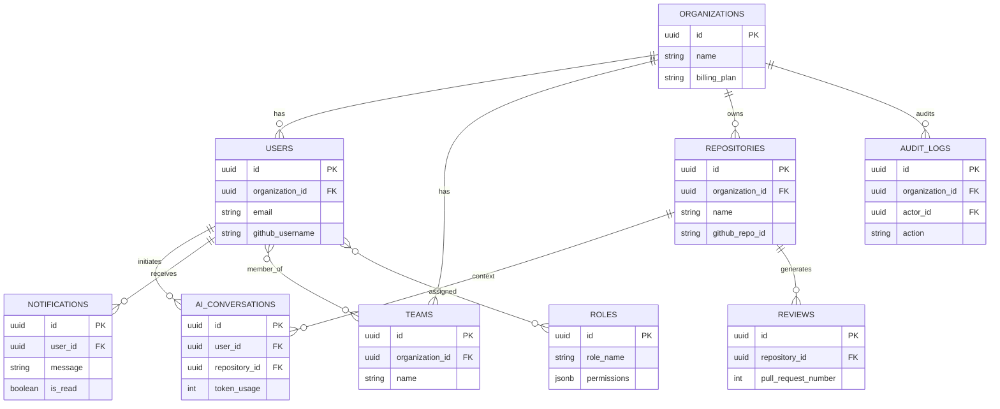

# Shadow Engineer: Database Architecture & Design

## 1. Purpose
The purpose of this document is to define the definitive database architecture for the Shadow Engineer platform. This blueprint ensures that the data layer is scalable, secure, and highly available, capable of supporting the system from a startup MVP to an enterprise deployment serving millions of developers. It outlines database selections, domain models, entity designs, indexing, security, and migration strategies without dictating implementation-level code.

---

## 2. Database Selection
The Shadow Engineer platform relies on a polyglot persistence architecture to handle distinct data workloads efficiently.

*   **PostgreSQL (Primary Relational Store):**
    *   *Purpose:* Stores strictly structured, ACID-compliant business metadata (Users, Repositories, Organizations, RBAC, Billing).
    *   *Trade-offs:* Slower horizontally scaling compared to NoSQL, but provides critical data integrity, foreign key constraints, and powerful JSONB capabilities for semi-structured analytics data.
*   **Redis (In-Memory Cache & Ephemeral State):**
    *   *Purpose:* Session management, API rate limiting, webhook deduplication, and caching high-frequency queries (e.g., active repository status).
    *   *Trade-offs:* Volatile storage (unless heavily configured with AOF), constrained by RAM costs, but provides sub-millisecond read/write latency.
*   **Qdrant (Vector Database):**
    *   *Purpose:* Stores dense vector embeddings of Abstract Syntax Trees (ASTs) and code chunks for the RAG engine.
    *   *Trade-offs:* Highly specialized and computationally expensive to index, but essential for semantic code similarity search.
*   **Neo4j (Future Knowledge Graph):**
    *   *Purpose:* Maps complex software dependencies (e.g., "Function A in Service B calls API C").
    *   *Trade-offs:* Requires complex graph traversal query languages (Cypher), deferred until post-MVP when architectural graphing becomes a core feature.

---

## 3. Domain Model
The relational domain model is segmented into the following business contexts:

*   **Identity & Access Management (IAM):** `Users`, `Organizations`, `Teams`, `Roles`, `Permissions`, `API Keys`.
*   **Version Control Metadata:** `Repositories`.
*   **AI Operations:** `AI Conversations`, `Reviews`, `Documents`.
*   **Platform Operations:** `Notifications`, `Analytics`, `Audit Logs`.

**Relationships:**
*   An *Organization* acts as the root tenant. It owns *Repositories*, *Teams*, and *Users*.
*   *Users* belong to *Organizations* and can be grouped into *Teams*.
*   *Repositories* generate *Reviews* and *Documents*, and act as the context boundary for *AI Conversations*.
*   *Users* trigger *AI Conversations* and receive *Notifications*.

---

## 4. Entity Design

### 4.1 Organizations
*   **Description:** The root tenant entity for B2B billing and data isolation.
*   **Primary Key:** `id` (UUID)
*   **Attributes:** `name` (String, Not Null), `billing_plan` (String, Default: 'FREE'), `github_installation_id` (String, Nullable).
*   **Constraints:** `name` must be unique.

### 4.2 Users
*   **Description:** Developers interacting with the platform.
*   **Primary Key:** `id` (UUID)
*   **Foreign Keys:** `organization_id` (References Organizations).
*   **Attributes:** `email` (String, Not Null), `github_username` (String, Not Null), `avatar_url` (String, Nullable).
*   **Constraints:** `email` and `github_username` are unique.

### 4.3 Roles & Permissions
*   **Description:** RBAC definitions.
*   **Primary Key:** `id` (UUID)
*   **Attributes:** `role_name` (String, e.g., 'ADMIN', 'DEVELOPER'), `permissions` (JSONB array of granted scopes).
*   **Unique Keys:** `role_name`.

### 4.4 Repositories
*   **Description:** Mapped GitHub repositories.
*   **Primary Key:** `id` (UUID)
*   **Foreign Keys:** `organization_id` (References Organizations).
*   **Attributes:** `github_repo_id` (String, Not Null), `name` (String, Not Null), `is_private` (Boolean, Default: true), `indexing_status` (String, Default: 'PENDING').
*   **Unique Keys:** Composite (`organization_id`, `github_repo_id`).

### 4.5 AI Conversations
*   **Description:** Chat sessions between a User and the AI IDE assistant.
*   **Primary Key:** `id` (UUID)
*   **Foreign Keys:** `user_id` (References Users), `repository_id` (References Repositories).
*   **Attributes:** `title` (String, Nullable), `token_usage` (Integer, Default: 0), `context_window_id` (String, Nullable).

### 4.6 Reviews
*   **Description:** Automated AI Pull Request reviews.
*   **Primary Key:** `id` (UUID)
*   **Foreign Keys:** `repository_id` (References Repositories).
*   **Attributes:** `pull_request_number` (Integer, Not Null), `status` (String, Default: 'ANALYZING'), `ai_summary` (Text, Nullable).

### 4.7 Documents
*   **Description:** AI-generated documentation (READMEs, architectures).
*   **Primary Key:** `id` (UUID)
*   **Foreign Keys:** `repository_id` (References Repositories).
*   **Attributes:** `file_path` (String, Not Null), `content_hash` (String, Not Null), `last_synced_at` (Timestamp).

### 4.8 Notifications
*   **Description:** Alerts sent to users.
*   **Primary Key:** `id` (UUID)
*   **Foreign Keys:** `user_id` (References Users).
*   **Attributes:** `type` (String, Not Null), `message` (Text, Not Null), `is_read` (Boolean, Default: false).

### 4.9 Analytics
*   **Description:** Aggregated daily metrics for teams/organizations.
*   **Primary Key:** `id` (UUID)
*   **Foreign Keys:** `organization_id` (References Organizations).
*   **Attributes:** `metric_date` (Date, Not Null), `total_tokens_used` (BigInt, Default: 0), `prs_reviewed` (Integer, Default: 0).

### 4.10 Audit Logs
*   **Description:** Immutable ledger of critical actions (e.g., API key generation, Role changes).
*   **Primary Key:** `id` (UUID)
*   **Foreign Keys:** `organization_id` (References Organizations), `actor_id` (References Users).
*   **Attributes:** `action` (String, Not Null), `ip_address` (String), `metadata` (JSONB).

### 4.11 API Keys
*   **Description:** Machine-to-machine integration keys.
*   **Primary Key:** `id` (UUID)
*   **Foreign Keys:** `organization_id` (References Organizations).
*   **Attributes:** `key_hash` (String, Not Null), `expires_at` (Timestamp, Nullable), `is_revoked` (Boolean, Default: false).

---

## 5. Relationship Design
*   **One-to-Many:**
    *   `Organization` (1) -> `Users` (N): A tenant has many developers.
    *   `Organization` (1) -> `Repositories` (N): A tenant owns multiple codebases.
    *   `User` (1) -> `AI Conversations` (N): A developer initiates multiple chats.
    *   `Repository` (1) -> `Reviews` (N): A repo receives many automated PR reviews.
*   **Many-to-Many:**
    *   `Users` (M) <-> `Teams` (N): A user belongs to many teams; a team has many users. Managed via a join table (`team_members`).
    *   `Users` (M) <-> `Roles` (N): Managed via `user_roles` join table for granular access control.

---

## 6. ER Diagram

---

## 7. Indexing Strategy
Indexes are designed to optimize high-frequency read operations while minimizing write penalties during webhook ingestion.

*   **B-Tree Indexes:** Applied to all Foreign Keys (`organization_id`, `user_id`) to speed up relational joins.
*   **Unique Indexes:** Applied to `users.email`, `users.github_username`, and `repositories.github_repo_id` to enforce data integrity and speed up authentication lookups.
*   **GIN Indexes:** Applied to `roles.permissions` and `audit_logs.metadata` to allow high-performance querying inside JSONB payloads.
*   **Partial Indexes:** Applied to `notifications.is_read = false` to optimize polling for unread alerts.

---

## 8. Normalization
The database is strictly normalized to **3rd Normal Form (3NF)** to ensure data consistency (e.g., separating Users from Roles and Teams). 

*Intentional Denormalization:*
*   The `Analytics` table stores pre-aggregated data (e.g., `total_tokens_used`) daily. This denormalization prevents expensive `SUM()` queries across millions of rows in the `AI_Conversations` table when rendering dashboards.

---

## 9. Soft Delete Strategy
To maintain referential integrity and audit trails, records are never physically deleted (`DELETE` statements).
Instead, all tables utilize a **Soft Delete** pattern:
*   A `deleted_at` (Timestamp, Nullable) column is added to all domain entities.
*   If `deleted_at` is `NULL`, the record is active.
*   Queries must always include `WHERE deleted_at IS NULL` (often enforced via JPA `@SQLRestriction` or Hibernate `@Where` clauses at the ORM layer).

---

## 10. Audit Columns
Every table in the PostgreSQL database must include the following standard audit fields for compliance and debugging:

*   `created_at` (Timestamp, Not Null, Default: `NOW()`)
*   `updated_at` (Timestamp, Not Null, Default: `NOW()`)
*   `created_by` (UUID, Nullable - tracks the actor)
*   `updated_by` (UUID, Nullable - tracks the actor)
*   `version` (Integer, Default: 0 - used for Optimistic Locking)

---

## 11. Naming Conventions
*   **Tables:** Plural, snake_case (e.g., `ai_conversations`, `api_keys`).
*   **Columns:** Singular, snake_case (e.g., `token_usage`, `is_read`).
*   **Primary Keys:** `id`.
*   **Foreign Keys:** `[entity_name]_id` (e.g., `organization_id`).
*   **Indexes:** `idx_[table]_[column]` (e.g., `idx_users_email`).
*   **Unique Constraints:** `uq_[table]_[column]` (e.g., `uq_users_github_username`).

---

## 12. Migration Strategy
Database schema changes are strictly version-controlled using **Flyway**.
*   No developer or DBA is permitted to make manual DDL changes to the database.
*   Migrations are written in plain SQL (`V1__init_schema.sql`, `V2__add_billing_columns.sql`) and stored in the source repository.
*   Flyway automatically executes these scripts on deployment, ensuring parity between local, staging, and production databases.

---

## 13. Backup & Recovery
*   **Frequency:** Automated daily snapshots via AWS RDS, with Point-In-Time Recovery (PITR) enabled. Continuous WAL (Write-Ahead Logging) archiving guarantees RPO (Recovery Point Objective) of 5 minutes.
*   **Retention:** 30 days for operational backups; 7 years for compliance-archived `Audit Logs` (moved to AWS Glacier).
*   **Recovery:** Automated Terraform scripts can restore a cluster from a snapshot into a different Availability Zone within 30 minutes (RTO).

---

## 14. Scaling Strategy
*   **MVP:** Single AWS RDS PostgreSQL instance (db.t4g.medium) handling all reads and writes.
*   **Growth (V1):** Introduction of Read-Replicas. Heavy queries (Analytics, Dashboard rendering) are routed to replicas to protect the write-master processing webhooks.
*   **Enterprise (V2):** Database sharding or partitioning. Time-series tables (`Analytics`, `Audit_Logs`) will be partitioned by `month` using PostgreSQL declarative partitioning. `Qdrant` vector collections will be sharded by `organization_id`.

---

## 15. Security
*   **Encryption at Rest:** All EBS volumes backing PostgreSQL, Redis, and Qdrant are encrypted using AWS KMS (AES-256).
*   **Encryption in Transit:** All database connections are forced to use TLS 1.3 (`sslmode=require`).
*   **Row-Level Security (RLS):** Enabled on all PostgreSQL tables. Database queries automatically evaluate the current execution context (tenant ID extracted from the JWT) to guarantee cross-tenant data bleed is impossible at the database level.
*   **Least Privilege:** Application services connect to the database using an IAM role or dedicated DB user that only has `SELECT`, `INSERT`, `UPDATE` privileges. DDL commands (`CREATE`, `DROP`) are strictly revoked for application users.
*   **Secret Management:** Database passwords are auto-rotated by AWS Secrets Manager; raw passwords never exist in source code or CI/CD pipelines.

---

## 16. Future Expansion
The architecture is designed to support the eventual migration to a microservices architecture.
*   Each domain (e.g., `Auth`, `Analytics`, `AI Operations`) is grouped logically.
*   If the `Analytics` domain is split into a separate microservice, its tables can be seamlessly migrated to a distinct database schema or an entirely separate PostgreSQL instance.
*   The Neo4j Graph DB will be introduced cleanly alongside Qdrant without requiring schema changes to PostgreSQL, as the relational database will merely pass the `repository_id` as the context key for graph traversals.
