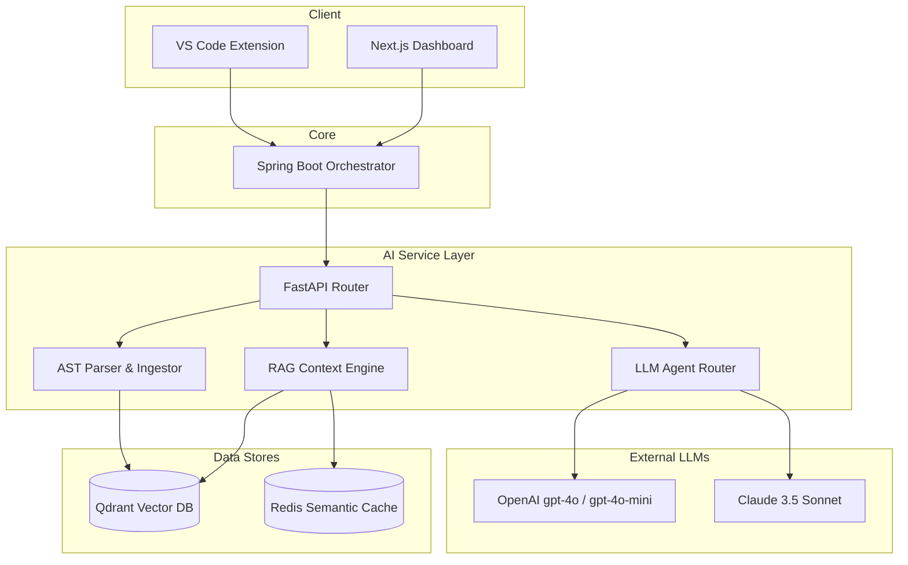
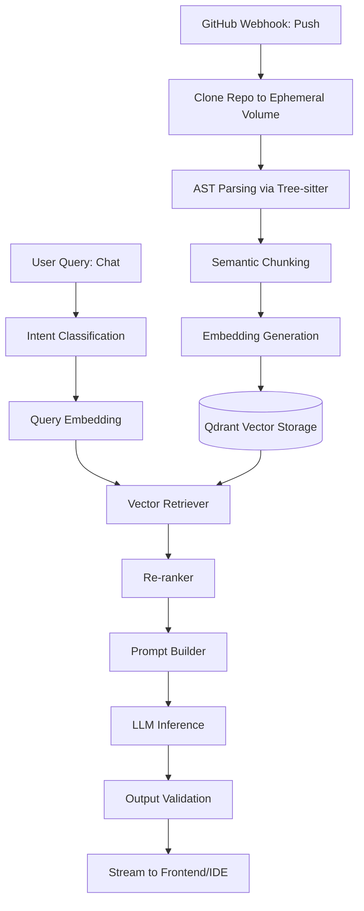

# Shadow Engineer: AI Architecture

## 1. AI Vision
The vision of the AI architecture within Shadow Engineer is to evolve the platform from a reactive "code generation" tool into a proactive, context-aware "engineering teammate." By leveraging advanced Retrieval-Augmented Generation (RAG) and specialized LLM orchestration, the AI does not just predict the next line of code; it comprehends the entire repository's architecture, historical context, and business logic, providing senior-level engineering insights on demand.

---

## 2. AI Goals

*   **Functional Goals:** Accurately parse and semantically index polyglot repositories. Generate structurally sound unit tests, perform deep architectural code reviews, and answer highly specific developer queries with citations.
*   **Non-Functional Goals:** Maintain sub-second retrieval latency for RAG operations. Ensure streaming inference responses begin within 800ms. Maintain strict tenant isolation at the vector level.
*   **Business Goals:** Reduce developer onboarding time by 50%. Decrease the time spent on manual code reviews by automating the detection of anti-patterns and logic flaws.

---

## 3. AI Capabilities
1.  **Repository Understanding:** Deep semantic indexing of source code, Markdown, and configuration files.
2.  **Repository Chat:** Context-aware conversational interface allowing developers to query the entire codebase natively from the IDE.
3.  **Code Review:** Automated analysis of Pull Request diffs against established architectural patterns.
4.  **Test Generation:** Contextually accurate unit and integration test generation utilizing existing repository mocking frameworks.
5.  **Documentation Generation:** Automated synchronization of `README.md` and inline JavaDocs/Docstrings based on recent commits.
6.  **Architecture Explanation:** High-level summarization of microservice interactions and data flows.
7.  **Knowledge Search:** Semantic search capabilities far surpassing standard Regex/AST searches.
8.  **PR Summaries:** Automated generation of human-readable Pull Request descriptions.
9.  **Developer Assistant:** Contextual IDE autocomplete and refactoring suggestions.
10. **Future Agent Features:** Autonomous bug fixing and multi-agent sprint execution.

---

## 4. AI System Overview

The AI subsystem operates as a high-performance Python FastAPI layer strictly segregated from the Java business logic, communicating via REST and asynchronous event queues.

---

## 5. End-to-End AI Workflow

---

## 6. RAG Architecture

*   **Chunking Strategy:** Character-based chunking destroys code semantics. We utilize Abstract Syntax Tree (AST) chunking via `Tree-sitter`, ensuring that functions, classes, and interfaces are kept whole within their respective chunks.
*   **Embedding Model:** OpenAI `text-embedding-3-small`. It offers a massive cost reduction while providing exceptional performance across multilingual codebases.
*   **Retriever & Hybrid Search:** We utilize Hybrid Search (Dense Vector Search + BM25 Sparse Keyword Search) in Qdrant. This ensures that abstract queries ("How does auth work?") map to vectors, while exact queries ("Where is `verifyToken()`?") map to exact syntax.
*   **Context Window:** The system dynamically prunes retrieved chunks to fit within a 32k-128k token context window, prioritizing the most relevant chunks using a Cross-Encoder Re-ranker (e.g., Cohere Rerank).
*   **Prompt Construction:** Context is injected using strict XML tags `<context>...</context>` to prevent prompt injection and guide the LLM's attention mechanism.
*   **Citation Strategy:** The LLM is instructed to append `[File: Line Number]` citations to every factual claim.
*   **Confidence Scoring:** If the top retrieved chunks fall below a predefined cosine similarity threshold, the system triggers a "Low Confidence" fallback, preventing hallucination by stating the information is missing.

---

## 7. Vector Database Design

*   **Why Qdrant:** Written in Rust, Qdrant offers unparalleled speed, local Docker support, and robust Payload Filtering, which is critical for multi-tenant isolation.
*   **Collections:** A single global collection `code_chunks` to maximize index density, utilizing Payload Filtering for isolation.
*   **Metadata:** Every vector payload contains: `tenant_id`, `repository_id`, `file_path`, `language`, `function_name`, and `commit_hash`.
*   **Filtering:** Queries heavily leverage `tenant_id` and `repository_id` filters. Qdrant filters the metadata *before* executing the HNSW vector search, guaranteeing zero cross-tenant data bleed.
*   **Indexing:** HNSW (Hierarchical Navigable Small World) combined with Product Quantization (PQ) to reduce RAM usage while maintaining 95%+ recall.
*   **Scalability & Backup:** Qdrant runs in a distributed cluster with replication factor 2. Snapshots are backed up to Amazon S3 daily.

---

## 8. Model Strategy

To balance reasoning capability with latency and cost, Shadow Engineer employs a multi-model routing strategy:

*   **Repository Chat (Complex):** OpenAI `gpt-4o` or Anthropic `Claude 3.5 Sonnet` for deep architectural reasoning.
*   **Repository Chat (Simple/Autocomplete):** OpenAI `gpt-4o-mini` for fast, low-latency code completion.
*   **Code Review:** `gpt-4o` due to its superior zero-shot performance in detecting logical flaws.
*   **Documentation & Summarization:** `gpt-4o-mini` or `Claude 3 Haiku`. These tasks are formatting-heavy but reasoning-light.
*   **Future Multi-model Support:** The AI router abstracts LLM providers behind a unified interface, allowing instant swapping to open-source models (Llama 3) if privacy requirements demand VPC-bound inference.

---

## 9. Prompt Engineering Strategy

*   **System Prompts:** Define the persona ("You are a Staff Software Engineer..."). They are immutable and highly guarded.
*   **Context Injection:** Code chunks are injected using structured XML delimiters to ensure the LLM clearly separates instructions from contextual data.
*   **Few-shot Examples:** Used extensively in the Code Review prompt to demonstrate exactly how JSON outputs or Markdown comments should be formatted.
*   **Prompt Versioning:** Prompts are stored in code (not a database) and version-controlled via Git to ensure deterministic testing.
*   **Prompt Safety:** Input from the user is sanitized and wrapped. The system prompt explicitly instructs the model to ignore any instructions found within the `<user_input>` blocks.

---

## 10. AI Memory

*   **Session/Conversation Memory:** Stored in Redis. Maintains the last 10 turns of dialogue for follow-up questions ("Can you rewrite *that* function?").
*   **Repository Memory:** Persistent context stored in Qdrant representing the codebase state.
*   **User Preferences:** Stored in PostgreSQL (e.g., "Always write tests in PyTest"). Injected into the system prompt at runtime.
*   **Long-term Memory:** Future scope involves generating a "Developer Profile" vector summarizing a user's coding style and historical mistakes over time.

---

## 11. AI Evaluation Framework

Quality is continuously measured using the **RAGAS (Retrieval Augmented Generation Assessment)** framework:

*   **Answer Accuracy & Groundedness:** "LLM-as-a-judge" periodically evaluates chat responses against the retrieved context to ensure no external hallucinations were introduced.
*   **Retrieval Precision/Recall:** Evaluated using a static golden dataset of 1,000 common architectural questions against our indexing pipeline.
*   **Latency:** API Gateway traces track Time-to-First-Token (TTFT) for streaming responses.
*   **Cost:** Tracked meticulously per tenant and per model via the Analytics Service.
*   **User Feedback:** Every chat response includes Thumbs Up/Down buttons, feeding a continuous feedback loop for prompt refinement.

---

## 12. AI Safety

*   **Hallucinations:** Mitigated by strict RAG grounding, hybrid search, and low-confidence fallbacks.
*   **Prompt Injection:** Mitigated via strict XML delimiter wrapping and a lightweight secondary LLM classifying inputs for adversarial intent before execution.
*   **Repository Poisoning:** AST parsers strip deeply nested or obfuscated code designed to exploit parser vulnerabilities (e.g., Billion Laughs attack).
*   **Sensitive Data Leakage:** A regex-based entropy scanner (TruffleHog integration) strips API keys, passwords, and PII from code chunks *before* they are sent to the embedding model or stored in Qdrant.
*   **Rate Abuse:** Enforced by API Gateway token buckets per tenant.

---

## 13. AI Cost Optimization

*   **Embedding Caching:** Unmodified files bypass the embedding pipeline during repository syncs by comparing Git file hashes.
*   **Semantic Prompt Caching:** Redis is used to cache identical user queries (using a high cosine similarity threshold) to serve answers instantly without incurring LLM inference costs.
*   **Model Routing:** Intent classification routes simple formatting questions to `gpt-4o-mini`, reserving `gpt-4o` only for deep architectural synthesis.
*   **Token Optimization:** Prompt context is dynamically truncated based on relevance scores to minimize input token costs.

---

## 14. AI Scalability

*   **Async Processing:** Repository ingestion is a massively parallel, CPU-bound task. It is offloaded to a Celery/RabbitMQ worker queue running on dedicated High-CPU EC2/EKS nodes.
*   **Horizontal Scaling:** The FastAPI inference routers are stateless and scale horizontally via Kubernetes HPA based on concurrent request volume.
*   **Multi-region Deployment:** Qdrant and FastAPI clusters will eventually deploy across multiple AWS regions to reduce geographic latency for global engineering teams.

---

## 15. Future AI Roadmap

*   **Autonomous Agents (ReAct):** Transitioning from static RAG to agentic workflows where the AI can autonomously execute bash commands, run test suites, and read logs to debug issues iteratively.
*   **GraphRAG (Neo4j):** Indexing the repository as a true Knowledge Graph, allowing the AI to traverse deep dependency chains (e.g., tracing a database schema change all the way up to the frontend UI components).
*   **Code Migration Assistant:** Multi-agent workflows designed to autonomously migrate legacy codebases (e.g., Java 8 to Java 21, or React Class Components to Hooks) over an entire repository.
*   **AI Pair Programmer:** Native voice integration in the IDE for real-time architectural discussions.
