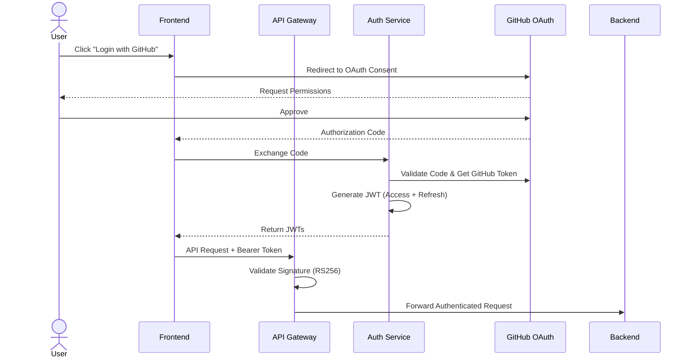
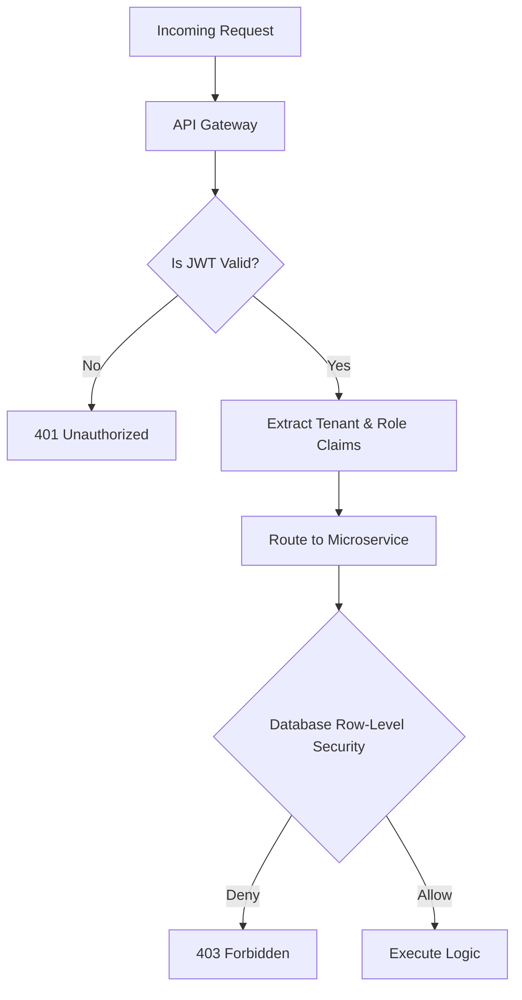
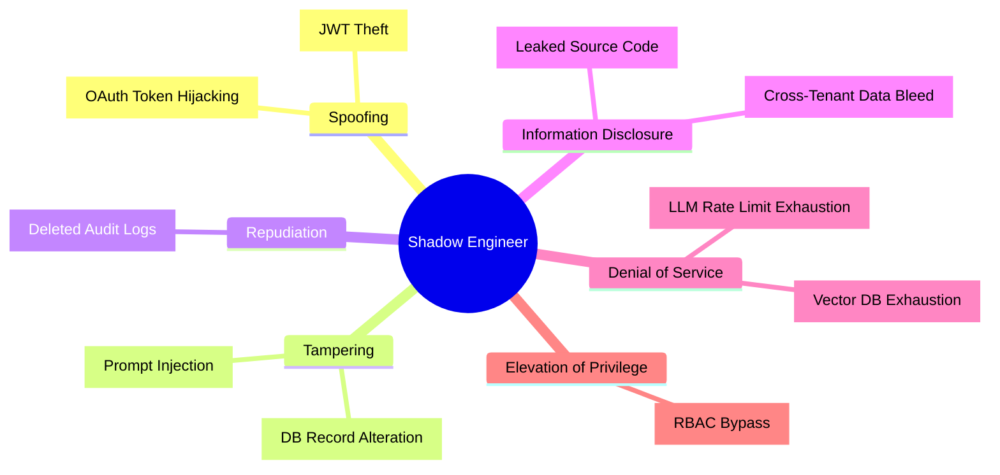

# Shadow Engineer: Security Architecture

## 1. Security Objectives
The primary security objective of the Shadow Engineer platform is to protect intellectual property (source code) and ensure the absolute integrity, confidentiality, and availability of customer data. As a SaaS platform handling proprietary enterprise codebases and integrating with third-party LLMs, securing the data pipeline against prompt injection, data leakage, and unauthorized access is paramount.

---

## 2. Security Principles
Our architecture is governed by the following core principles:

*   **Zero Trust:** No entity (user, internal microservice, or external API) is trusted by default. Every request must be strongly authenticated and authorized regardless of network location.
*   **Least Privilege:** Users, services, and AI agents are granted only the minimum permissions necessary to perform their required tasks.
*   **Defense in Depth:** Multiple layers of security controls (e.g., API Gateway validation, Network ACLs, Database RLS, and LLM output sanitization) protect the system. If one layer fails, others remain.
*   **Secure by Default:** Security settings are strict out-of-the-box. Users must explicitly opt-in to relax security postures.
*   **Fail Securely:** If a system or process fails, it must fail into a secure state (e.g., denying access rather than bypassing authentication) and log the failure.

---

## 3. Authentication Architecture

Shadow Engineer uses stateless, token-based authentication federated via Identity Providers (IdP).

*   **OAuth2 (GitHub):** The primary mechanism for user login, granting both user identity and delegated access to repository APIs.
*   **JWT (JSON Web Tokens):** Used for stateless session management. JWTs are signed asymmetrically (RS256).
*   **Refresh Tokens:** Stored securely and used to obtain new access tokens without requiring re-authentication. They are bound to specific device fingerprints and rotated on use.
*   **Session Expiry:** Access tokens expire in 15 minutes. Refresh tokens expire in 7 days of inactivity or 30 days absolute.

### Authentication Flow

---

## 4. Authorization Model (RBAC)

Authorization utilizes a strict Role-Based Access Control (RBAC) model at the Organization and Project/Repository levels.

**Defined Roles & Permissions:**
*   **Super Admin:** Global platform administrator (internal shadow-engineer employees only). Manages billing tiers and global LLM configurations.
*   **Organization Admin:** Tenant owner. Can manage billing, invite users, and alter global organization settings.
*   **Project Admin:** Manages repository settings, AI review policies, and team assignments within a specific repository.
*   **Developer:** Standard user. Can trigger AI reviews, generate docs, and chat with the codebase.
*   **Reviewer:** Can view AI generated reviews and analytics, but cannot trigger new codebase ingestions.
*   **Viewer:** Read-only access to documentation and analytics dashboards.

### Authorization Flow

---

## 5. API Security
*   **HTTPS Only:** TLS 1.3 is strictly enforced. HTTP is permanently redirected.
*   **API Gateway Security:** Acts as a choke point enforcing rate limits, IP blocklists, and JWT signature validation.
*   **CORS:** Strictly whitelisted to the production frontend domain.
*   **CSRF Protection:** Implemented via SameSite cookie attributes (if cookies are used for refresh tokens) and standard anti-CSRF tokens for mutating state.
*   **Rate Limiting:** IP-based and Tenant-based token bucket algorithms to prevent DDoS and API abuse.
*   **Input Validation:** Strict OpenAPI schema validation via Spring Boot (`@Valid`) and FastAPI (`Pydantic`).

---

## 6. Data Security
*   **Encryption at Rest:** All EBS volumes (PostgreSQL, Redis, Qdrant) are encrypted using AWS KMS (AES-256).
*   **Encryption in Transit:** Enforced TLS 1.3 internally between microservices.
*   **Secret Management:** HashiCorp Vault injects secrets into containers at boot time.
*   **Key Rotation:** Automatic 90-day key rotation via AWS KMS.
*   **Database Security:** Row-Level Security (RLS) ensures a user can only select rows where `tenant_id` matches their JWT claim.

---

## 7. AI Security
Integrating external LLMs introduces novel attack vectors.

*   **Prompt Injection Mitigation:** User input is strictly parameterized and wrapped in delimiter boundaries. The system uses a secondary lightweight classifier model to detect prompt injection attempts before sending payloads to the expensive primary LLM.
*   **Prompt Leakage Prevention:** System prompts instruct the LLM to refuse requests asking to "ignore previous instructions" or "reveal system prompts."
*   **Malicious Repository Content:** Codebases containing obfuscated malware or reverse shells are sanitized. The AI AST parser strips non-printable characters and truncates excessively long lines.
*   **LLM Output Validation:** AI-generated responses (especially generated code or test scripts) are parsed and validated for syntactic safety before being returned to the user.
*   **Zero Retention Policy:** Enterprise agreements guarantee OpenAI/Anthropic do not retain Shadow Engineer prompts or use customer code for model training.

---

## 8. Threat Model (STRIDE)

| Category | Threat | Risk | Impact | Mitigation |
| :--- | :--- | :--- | :--- | :--- |
| **Spoofing** | Stolen JWT allows attacker to impersonate user. | High | Critical | Short-lived Access Tokens (15 min); IP anomaly detection. |
| **Tampering** | User injects malicious prompt into source code. | Medium | High | LLM output validation; secondary injection-detection classifier. |
| **Repudiation** | Malicious admin deletes logs to cover tracks. | Low | High | Forward logs to immutable, WORM (Write Once Read Many) storage bucket. |
| **Info Disclosure** | Attacker queries Vector DB to read another org's code. | High | Critical | Namespace isolation in Qdrant; RLS in PostgreSQL. |
| **DoS** | Attacker spams AI Chat, exhausting token quota. | Medium | Medium | Strict tenant-level rate limiting at API Gateway. |
| **Elevation of Privilege** | User alters API request to modify another org's repo. | High | Critical | Domain-level ownership validation checks on every API route. |

---

## 9. Audit & Compliance
*   **Audit Logs:** A centralized `Audit_Logs` table records every mutating action (Create, Update, Delete), tracking the `actor_id`, `timestamp`, and `changes`.
*   **Security Event Logs:** Failed logins, rapid bursts of API errors, and detected prompt injections are forwarded to a SIEM.
*   **Tamper Protection:** Audit logs are append-only.
*   **Log Retention:** Kept in hot storage for 30 days, then moved to AWS Glacier for 7 years to meet compliance standards (SOC2).

---

## 10. Monitoring
*   **Suspicious Activity Detection:** Cloudflare/WAF detects Tor exit nodes, known malicious IPs, and excessive failed logins.
*   **Rate Limit Monitoring:** Grafana alerts trigger if an organization hits 90% of their API/LLM quota.
*   **Incident Response:** PagerDuty integrations automatically page the on-call security engineer for severity-1 alerts (e.g., sudden spike in 403 Forbidden errors globally).

---

## 11. Dependency & Container Security
*   **Dependency Scanning:** Snyk / GitHub Dependabot runs on every PR to prevent vulnerable open-source libraries from being merged.
*   **Secret Detection:** TruffleHog scans all commits to ensure API keys (e.g., OpenAI keys) are never pushed to the source repository.
*   **Docker Image Scanning:** Trivy scans container layers during the CI pipeline. Builds fail immediately if High/Critical CVEs are detected.

---

## 12. Secure Development Lifecycle (SDLC)
*   **Development:** Engineers use IDE linters configured with SonarLint to catch security flaws (e.g., SQL injection) as they type.
*   **Code Review:** Mandatory two-person approval for PRs. AI Code Review agent acts as a first-pass security screener.
*   **Testing:** Automated DAST (Dynamic Application Security Testing) runs against ephemeral staging environments before deployment.
*   **CI/CD:** No human has direct access to production keys; deployments are strictly automated.

---

## 13. Future Security Enhancements
As Shadow Engineer prepares for enterprise compliance (SOC2 Type II, ISO 27001), the following enhancements will be implemented:
*   **MFA (Multi-Factor Authentication):** Enforced globally for all Organization Admins.
*   **Enterprise SSO:** SAML 2.0 integration for Azure AD, Okta, and Google Workspace.
*   **Passkeys & WebAuthn:** Passwordless, phishing-resistant authentication.
*   **Request Signing:** Implementing Mutual TLS (mTLS) or HMAC request signing for machine-to-machine integrations to prevent Man-in-the-Middle attacks.
