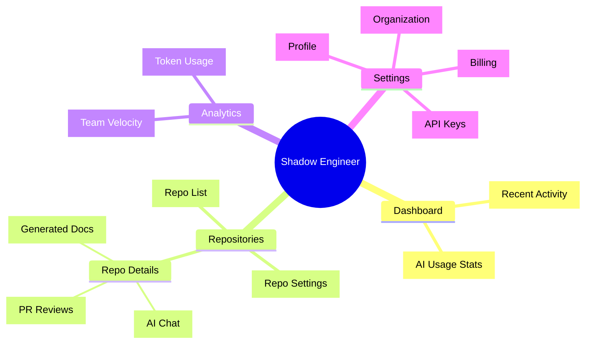
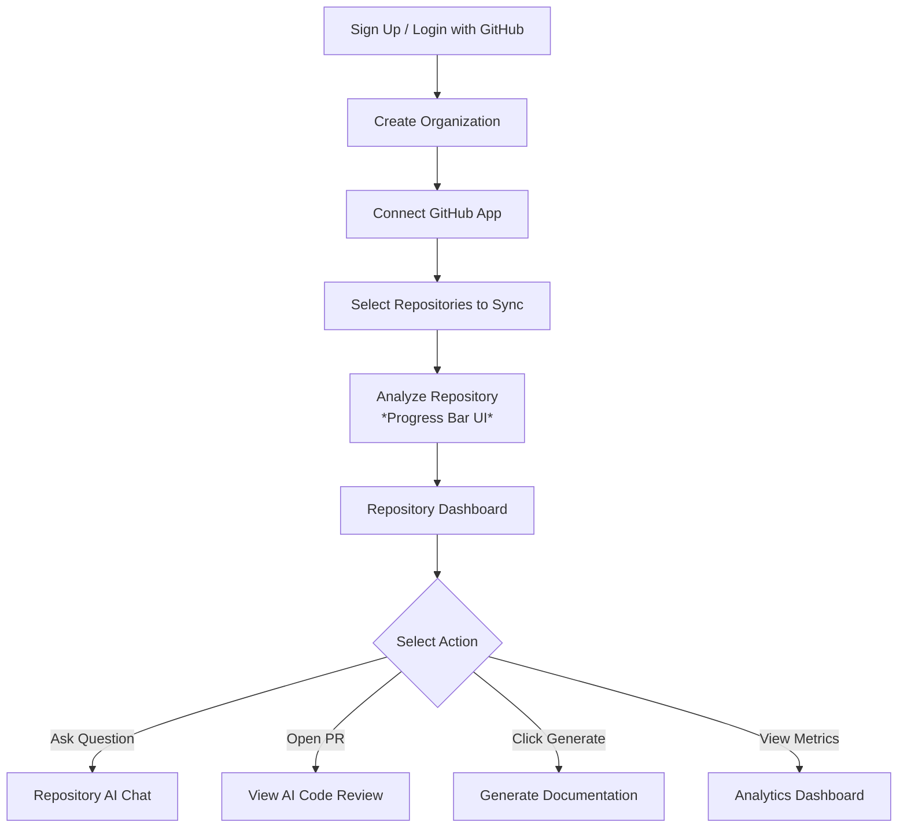

# Shadow Engineer: UI/UX Design Specification

## 1. Product Design Vision
The design vision for Shadow Engineer is to create an interface that feels like an extension of the developer's thought process. Drawing inspiration from enterprise productivity giants like Linear, Vercel, and Stripe, the UI must be blazingly fast, visually unobtrusive, and fiercely focused on content. The AI should not feel like an invasive chatbot, but rather an omniscient pair programmer gracefully integrated into the repository dashboards and IDE interfaces.

---

## 2. Design Principles
*   **Minimal & Developer-First:** Omit unnecessary illustrations, heavy gradients, and marketing fluff. Use high-contrast typography, dense data tables, and Monaco/Fira Code for code blocks.
*   **Fast Navigation:** Everything must be accessible via keyboard shortcuts (e.g., `Cmd+K` / `Ctrl+K` for global command palettes).
*   **AI-First Experience:** AI interactions should feel native. Streaming text should render instantly, and AI actions (generate tests, review code) should be one-click context menus.
*   **Consistency:** A rigorous design system (shadcn/ui + Tailwind) ensures that a button on the Admin panel feels identical to a button in the AI Chat.
*   **Accessibility:** Strict adherence to WCAG 2.2 AA standards.
*   **Responsive Design:** While primarily a desktop tool (developers use large monitors), the web dashboard must gracefully collapse for tablet/mobile on-the-go reviews.

---

## 3. Information Architecture

The platform follows a nested hierarchy revolving around the Organization and its Repositories.



---

## 4. User Roles & UI Flows

*   **Super Admin:** Sees a global "Platform Health" dashboard. Can view all tenants, toggle feature flags, and manage underlying LLM configurations.
*   **Organization Admin:** Sees the Billing tab, API Keys, and User Management. Can revoke repository access for team members.
*   **Developer:** The primary persona. Enters the app, selects a repository, and immediately enters the AI Chat or triggers an AI PR Review. Settings are limited to Personal Profile.
*   **Reviewer:** Focuses on the "PR Reviews" tab. The UI highlights AI-generated comments and diffs, allowing the reviewer to quickly approve or request changes.
*   **Viewer:** Read-only access. UI hides all "Action" buttons (e.g., "Trigger Ingestion", "Generate Docs").

---

## 5. User Journey



---

## 6. Screen Inventory

| Screen Name | Description |
| :--- | :--- |
| **Landing Page** | High-conversion marketing page featuring a dark-mode terminal aesthetic. |
| **Authentication** | Minimal login page. Single prominent button: "Continue with GitHub". |
| **Onboarding** | Stepper UI: Org Name -> Connect GitHub -> Select Repositories. |
| **Global Dashboard** | Organization overview. Card grid of synced repositories and high-level activity feed. |
| **Repository Details** | The core workspace. Displays sync status, last commit, and quick-action buttons. |
| **AI Chat Panel** | Chat interface with markdown rendering, syntax highlighting, and file citation links. |
| **AI PR Review** | Split-pane diff viewer highlighting AI-detected issues inline. |
| **Documentation View** | Notion-style rich text editor for AI-generated architecture docs. |
| **Analytics** | Grafana-style charts showing token usage, review acceptance rates, and team velocity. |
| **Settings (Profile & Org)**| Form layouts for managing SSH keys, API tokens, and members. |
| **Command Palette** | `Cmd+K` modal overlay for instant global navigation. |

---

## 7. Dashboard Layout

The UI utilizes a classic SaaS layout optimized for high data density, similar to Linear and Vercel.

```mermaid
graph TD
    subgraph Browser Window
        subgraph Top Navigation
            Breadcrumbs[Org / Repo / Feature]
            Search[Cmd+K Search Bar]
            Profile[User Avatar & Dropdown]
        end
        subgraph Left Sidebar
            Nav1[Repositories]
            Nav2[AI Chat]
            Nav3[Reviews]
            Nav4[Analytics]
            Nav5[Settings]
        end
        subgraph Main Content Area
            subgraph Header
                Title[Repository Name]
                Actions[Generate Docs | Sync Repo]
            end
            subgraph Content Grid
                Card1[Sync Status & Metadata]
                Card2[Recent AI Activity]
                Panel[Interactive AI Chat or Data Table]
            end
        end
    end
```

**Layout Explanations:**
*   **Sidebar:** Slim, icon-heavy on desktop. Collapses into a hamburger menu on mobile.
*   **Top Navigation:** Context-aware breadcrumbs are crucial so developers know exactly which repository context the AI is using.
*   **Main Content Area:** Max-width constrained (e.g., `max-w-7xl`) for readability on ultrawide monitors.

---

## 8. Design System

Built on **Tailwind CSS** and **shadcn/ui**.

*   **Typography:** 
    *   Headings & UI: `Inter` or `Geist`. (Clean, highly legible sans-serif).
    *   Code Blocks: `JetBrains Mono` or `Fira Code` with ligatures enabled.
*   **Color Palette (Dark Mode Default):**
    *   Background: Deep Gray/Black (`#09090b`).
    *   Surface/Cards: Slightly lighter gray (`#18181b`).
    *   Primary Accent: Vibrant Indigo (`#6366f1`) or Vercel-style crisp white for stark contrast.
    *   Success/Error: Standard Green (`#10b981`) and Red (`#ef4444`).
*   **Spacing & Grid:** 4pt grid system (`spacing: 4, 8, 12, 16, 24, 32`).
*   **Buttons:** Flat design. Slight scale transform on hover. No heavy drop shadows.
*   **Inputs & Forms:** Subdued borders (`border-zinc-800`). Focus states use a subtle primary color ring.
*   **Badges:** Used heavily to indicate repository status (`Synced`, `Ingesting`, `Failed`).

---

## 9. Component Library

Reusable components that form the building blocks of the UI:

*   **MarkdownRenderer:** A highly customized React-Markdown component that supports Mermaid diagrams, syntax highlighting (Prism/Shiki), and LaTeX.
*   **CodeSnippet:** Includes a "Copy to Clipboard" button and line numbers.
*   **CitationChip:** Small, clickable chips (e.g., `[AuthService.java:45]`) that the AI generates to prove groundedness. Clicking opens the file viewer.
*   **DiffViewer:** Renders git diffs natively in the browser with inline AI comments.
*   **SkeletonLoader:** Replaces traditional spinners with pulse-animated skeleton cards matching the eventual content layout.

---

## 10. Responsive Design

*   **Desktop (>1024px):** Full sidebar, split-pane views (e.g., Chat on the left, Code on the right).
*   **Tablet (768px - 1024px):** Sidebar collapses to icons only. Grid layouts reduce from 3 columns to 2 columns.
*   **Mobile (<768px):** Bottom navigation bar or hamburger menu. AI Chat consumes 100% of the viewport width. Complex diff viewers are hidden or simplified to summary views.

---

## 11. Accessibility (A11y)

*   **WCAG 2.2 AA Compliance:** Guaranteed across all views.
*   **Keyboard Navigation:** The entire platform can be navigated without a mouse. Arrow keys navigate tables and file trees. Enter triggers actions.
*   **Focus Management:** Visible focus rings (`focus-visible:ring-2`) on all interactive elements. Modals trap focus until closed.
*   **Color Contrast:** All text meets the 4.5:1 contrast ratio against its background.
*   **Screen Readers:** `aria-labels` on all icon-only buttons. Live regions (`aria-live="polite"`) announce when AI chat generation completes.

---

## 12. Animation Guidelines

Animations must feel instantaneous and purposeful, never slowing down the developer.

*   **Micro-interactions:** Buttons scale down by 2% on `:active`.
*   **Page Transitions:** Instantaneous. Next.js App Router pre-fetches pages for zero-delay navigation.
*   **AI Thinking State:** Instead of a generic spinner, use a subtle pulsing cursor or a skeleton text block mimicking typing to indicate the LLM is generating tokens.
*   **Streaming Text:** LLM responses must stream smoothly chunk-by-chunk without janky re-renders.

---

## 13. Dark & Light Themes

*   **Dark Mode (Default):** Developers overwhelmingly prefer dark mode. The UI uses extremely dark slate grays (not pure black) to reduce eye strain. Text is off-white (`#f4f4f5`) rather than pure white to prevent halation.
*   **Light Mode:** Clean, GitHub-esque aesthetic. Crisp white backgrounds (`#ffffff`) with subtle gray borders (`#e5e7eb`) and dark gray text.
*   **Switching:** Controlled via a toggle in the user profile and synchronized with the `prefers-color-scheme` CSS media query.

---

## 14. Future UI Expansion

*   **VS Code Extension UI:** Translating the web dashboard's AI Chat into a native IDE side-panel extension using WebViews.
*   **Plugin Marketplace:** A dedicated UI namespace for browsing and installing third-party integrations (e.g., Jira, Slack).
*   **Mobile App:** A lightweight companion app focused purely on approving AI PR reviews and viewing notifications on the go.
*   **Interactive Architecture Maps:** A canvas-based UI (similar to Figma or React Flow) allowing developers to visually navigate the AI-generated Knowledge Graph of their repository.
