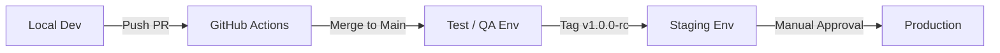
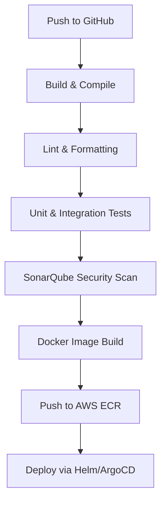
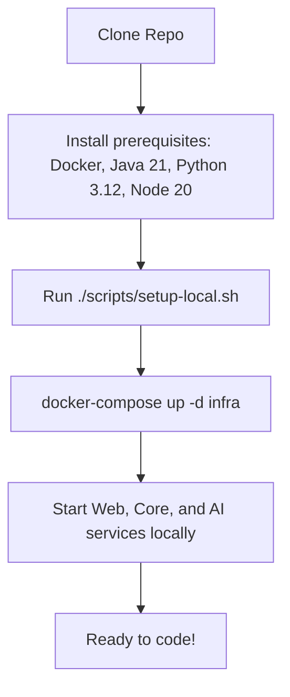

# Shadow Engineer: Engineering Blueprint

## 1. Engineering Philosophy
To build a maintainable, scalable, and resilient AI platform, our engineering team adheres strictly to the following principles:

*   **Clean Architecture:** Strict separation of concerns. Business rules (Domain) must not depend on UI, database frameworks, or external AI APIs.
*   **SOLID:** Single Responsibility, Open-Closed, Liskov Substitution, Interface Segregation, and Dependency Inversion. We write code that is easy to extend but hard to break.
*   **DRY (Don't Repeat Yourself):** Logic is abstracted into shared libraries (e.g., DTOs, utilities) to prevent duplication across microservices.
*   **KISS (Keep It Simple, Stupid):** We favor readable, explicit code over "clever" abstractions. Debugging a 3:00 AM production incident requires simplicity.
*   **YAGNI (You Aren't Gonna Need It):** We build for the requirements of today, architect for the scale of tomorrow, but never implement speculative features.

---

## 2. Repository Strategy

Shadow Engineer utilizes a **Monorepo** strategy managed via Turborepo (for TS/JS) and unified root scripts. This ensures atomic commits across frontend, backend, and AI services, eliminating version mismatch issues between microservices.

```mermaid
mindmap
  root((shadow-engineer/))
    apps/
      [web (Next.js)]
      [api-gateway (Spring Cloud)]
      [core-service (Spring Boot)]
      [ai-service (FastAPI)]
    packages/
      [shared-dto (TS/Java)]
      [ui-components (React)]
      [core-utils (Python)]
    infrastructure/
      [terraform]
      [kubernetes]
      [docker]
    docs/
      [01_Product]
      [02_Requirements]
      [03_Architecture]
      [04_Database]
    scripts/
      [setup.sh]
      [deploy.sh]
    .github/
      [workflows]
```

---

## 3. Application Structure

*   **Frontend (`apps/web`):** Next.js 14 (App Router), React, Tailwind CSS, shadcn/ui.
*   **Backend (`apps/core-service`):** Spring Boot 3 (Java 21), PostgreSQL, Redis. Handles business logic and orchestration.
*   **API Gateway (`apps/api-gateway`):** Spring Cloud Gateway. Handles JWT validation, rate limiting, and routing.
*   **AI Service (`apps/ai-service`):** Python FastAPI, Qdrant, OpenAI/Anthropic SDKs. Handles AST parsing and RAG.
*   **Shared Libraries (`packages/`):** Code utilized by multiple applications (e.g., unified DTOs, ESLint configs).
*   **Infrastructure (`infrastructure/`):** IaC via Terraform, Helm charts, and Dockerfiles.
*   **Documentation (`docs/`):** System architecture, ADRs, PRDs.
*   **Scripts (`scripts/`):** Developer quality-of-life scripts (e.g., `seed-db.sh`).
*   **Configuration:** Global `.editorconfig`, `.prettierrc`, and `checkstyle.xml`.

---

## 4. Shared Libraries

To enforce the DRY principle, the `packages/` directory contains:
*   **DTOs:** Shared data transfer objects (TypeScript types generated from OpenAPI specs).
*   **Constants:** Global error codes, feature flags, and system-wide enum values.
*   **Utilities:** Reusable logging wrappers, date parsers, and string sanitizers.
*   **Security:** Standardized JWT verification middlewares.
*   **Common Components:** Custom React components (e.g., Markdown renderer) used across web and future VS Code extensions.

---

## 5. Dependency Management

*   **Node.js / TypeScript:** We use `pnpm` for fast, disk-efficient workspace management across `apps/web` and `packages/ui-components`.
*   **Java (Spring Boot):** We use `Maven` with a multi-module `pom.xml` at the Java root to synchronize Spring Boot versions across Gateway and Core services.
*   **Python (FastAPI):** We use `Poetry` for deterministic dependency resolution and virtual environment management.
*   **Package Policies:** All dependencies are pinned to specific versions (no `^` or `~`). Dependabot automatically opens PRs for CVEs and minor version bumps.

---

## 6. Environment Strategy



*   **Local Development:** Run via `docker-compose up` bridging local Java/Python processes to containerized databases.
*   **Testing Env:** Ephemeral environments spun up per Pull Request for automated E2E tests.
*   **Staging Env:** An exact replica of Production, connected to sanitized database snapshots.
*   **Production Env:** AWS EKS cluster serving live traffic.
*   **Secrets Management:** Local dev uses `.env` files. CI/CD and Production use HashiCorp Vault / AWS Secrets Manager injected at runtime.

---

## 7. Git Strategy

We follow **Trunk-Based Development** heavily influenced by GitHub Flow.

*   **Branch Strategy:** 
    *   `main`: Always deployable. Represents production state.
    *   `feat/ticket-id-desc`: Feature branches off `main`.
    *   `fix/ticket-id-desc`: Bugfix branches.
*   **Commit Message Convention:** We strictly enforce **Conventional Commits** (e.g., `feat(auth): add GitHub OAuth`, `fix(ai): resolve AST chunking issue`).
*   **Semantic Versioning:** Releases follow `MAJOR.MINOR.PATCH`.
*   **Git Tags:** Tags (e.g., `v1.2.0`) automatically trigger staging/production deployment workflows.
*   **Pull Request Workflow:** Code must be reviewed by at least one peer. CI must pass (Tests, Linting, SonarQube). Branches must be up to date with `main` before merging (Rebase & Merge preferred).

---

## 8. Coding Standards

*   **Java:** Adherence to Google Java Style Guide. Enforced via `Checkstyle` and `Spotless`.
*   **TypeScript:** Strict mode enabled. Adherence to Airbnb standard. Enforced via `ESLint` and `Prettier`.
*   **Python:** Adherence to PEP-8. Type hints are mandatory. Enforced via `Black`, `isort`, and `mypy`.
*   **Documentation:** All public APIs must have OpenAPI annotations. All complex classes must have Javadoc/Docstrings explaining *why*, not just *what*.

---

## 9. Testing Strategy

*   **Unit Testing:** (JUnit 5, PyTest, Jest). Focus on isolated business logic. Mocks used heavily (Mockito). Minimum coverage: 80%.
*   **Integration Testing:** Testcontainers used in Java/Python to spin up real PostgreSQL/Qdrant instances during CI to test database interactions.
*   **Contract Testing:** Pact used to ensure the Python AI API and Java Core API agree on JSON structures.
*   **E2E Testing:** Playwright used to simulate real user journeys in the browser.
*   **Security Testing:** OWASP ZAP runs weekly in staging.

---

## 10. CI/CD Overview



*   **Rollback:** Handled automatically by Kubernetes/ArgoCD if the health check probe fails post-deployment.
*   **Notifications:** CI/CD pipelines post statuses directly to the engineering Slack channel.

---

## 11. Docker Strategy
*   All applications utilize **Multi-Stage Builds** to keep final production images tiny and secure (distroless or alpine bases).
*   Images run as a non-root user for security compliance.
*   Image tags align with Git commit SHAs (`shadow-engineer-core:a1b2c3d`).

---

## 12. Kubernetes Strategy
*   Deployments managed declaratively via Helm charts.
*   **HPA (Horizontal Pod Autoscaler):** Scales FastAPI pods based on CPU/Queue metrics to handle spikes in repository ingestion.
*   **Liveness/Readiness Probes:** Configured via Spring Boot Actuator and FastAPI Health endpoints.

---

## 13. Infrastructure Overview
*   **AWS Services:** EKS (Compute), RDS (PostgreSQL), ElastiCache (Redis), S3 (Static assets/Backups), MSK (Future Kafka).
*   **Networking:** Private VPC. Only the API Gateway is exposed to the internet via an Application Load Balancer (ALB).
*   **Monitoring/Logging:** OpenTelemetry traces and FluentBit logs shipped to a centralized observability stack (Grafana / Datadog).
*   **SSL & DNS:** Managed via AWS Route53 and ACM (AWS Certificate Manager).

---

## 14. Developer Onboarding


*   A new engineer should be able to run the entire stack locally within 30 minutes of cloning the repository using standard Docker Compose files and a `.env.example` template.

---

## 15. Engineering Best Practices

1.  **Leave the codebase better than you found it (Boy Scout Rule).**
2.  **No Broken Windows:** Fix warnings, deprecations, and flaky tests immediately. Do not tolerate technical debt in core paths.
3.  **Code Reviews are for Mentorship, not gatekeeping:** Be kind, be constructive, and explain your reasoning.
4.  **Log with Context:** "Error occurred" is useless. "Error parsing AST for repo_id=123, file=auth.py: NullReference" is actionable.
5.  **Automate Everything:** If you do a task twice, script it.
